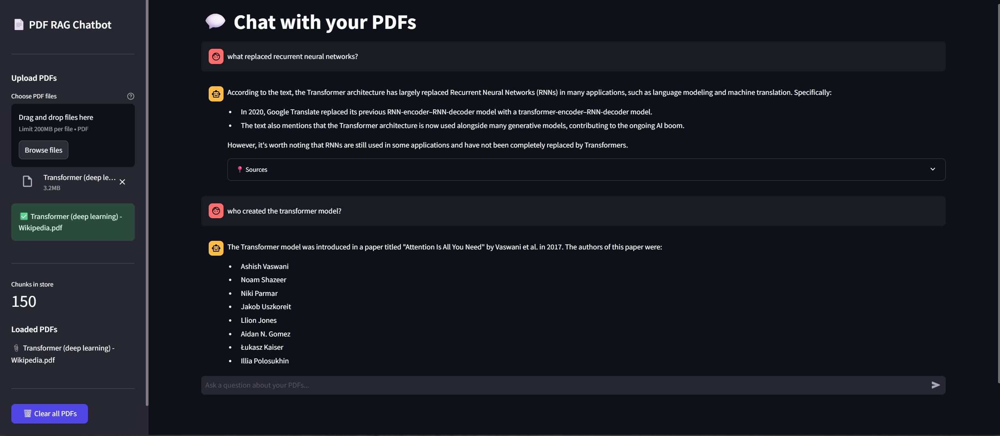

# 📄 PDF RAG Chatbot

> Chat with your PDFs using a fully local RAG pipeline — no API keys, no cost, complete privacy.



---

## What is this?

A **Retrieval-Augmented Generation (RAG)** chatbot that lets you upload PDFs and ask questions about them. Instead of sending your documents to a cloud service, everything runs locally on your machine using [Ollama](https://ollama.com).

**The core idea:**
LLMs can't "remember" your documents — their weights are frozen. RAG solves this by converting your PDFs into searchable vectors, finding the most relevant chunks at query time, and feeding them to the LLM as context. The model answers based on *your documents*, not its training data.

```
PDF → chunks → embeddings → vector store
                                  ↑
User question → embedding → similarity search → top 5 chunks → LLM → answer + sources
```

---

## Features

-  **Fully local** — Ollama runs the LLM on your machine, zero API costs
-  **Multi-PDF support** — upload and query across multiple documents simultaneously  
-  **Source citations** — every answer shows which page and file it came from
-  **Chat interface** — full conversation history with a clean Streamlit UI
-  **Docker support** — runs identically on any machine

---

## Tech Stack

| Layer | Tool | Why |
|-------|------|-----|
| LLM | Ollama (llama3.1:8b) | Local inference, no API cost |
| Embeddings | OllamaEmbeddings | Semantic search over chunks |
| Vector DB | ChromaDB | Lightweight local vector store |
| Pipeline | LangChain | Standard RAG building blocks |
| UI | Streamlit | Fast Python-native web interface |
| Containers | Docker + Compose | Reproducible environment |

---

## How RAG Works (Theory)

**1. Ingestion**
- PDFs are loaded page by page using `PyPDFLoader`
- Text is split into 800-character chunks with 150-character overlap
- Overlap prevents cutting sentences mid-thought, preserving semantic meaning
- Each chunk is converted to a vector (embedding) capturing its meaning mathematically

**2. Retrieval**
- The user's question is also converted to a vector using the same embedding model
- ChromaDB finds the 5 most semantically similar chunks via cosine similarity
- "Similar" means conceptually related — not just keyword matching

**3. Generation**
- The 5 chunks + the user's question are stuffed into a single prompt
- Ollama generates an answer grounded *only* in the retrieved context
- `temperature=0.1` keeps answers factual and deterministic

---

## Setup

### Prerequisites
- Python 3.10+
- [Ollama](https://ollama.com) installed and running
- Docker (optional)

### 1. Clone the repo
```bash
git clone https://github.com/YOUR_USERNAME/pdf-rag-chatbot.git
cd pdf-rag-chatbot
```

### 2. Pull the model
```bash
ollama pull llama3.1:8b
```

### 3. Install dependencies
```bash
pip install -r requirements.txt
```

### 4. Configure environment
```bash
cp .env.example .env
# Edit .env if needed — defaults work out of the box
```

### 5. Run the app
```bash
streamlit run Streamlit_App.py
```

Open [http://localhost:8501](http://localhost:8501) in your browser.

---

## Docker Setup

```bash
docker-compose up --build
```

The app will be available at [http://localhost:8501](http://localhost:8501).  
Ollama runs as a separate container — models persist between restarts via a Docker volume.

---

## Project Structure

```
pdf-rag-chatbot/
├── app.py              # Streamlit UI — upload PDFs, chat interface
├── ingest.py           # PDF loading, chunking, and vector store builder
├── rag_chain.py        # RAG pipeline — retriever + LLM chain
├── cli_test.py         # CLI tool for testing without UI
├── requirements.txt    # Python dependencies
├── Dockerfile          # Container definition for the app
├── docker-compose.yml  # Multi-container setup (app + Ollama)
├── .env.example        # Environment variable template
├── data/               # Drop PDFs here for CLI ingestion
└── assets/             # Screenshots and demo media
```

---

## Usage

1. Open the app in your browser
2. Upload one or more PDFs using the sidebar
3. Click **Ingest** for each PDF — this builds the vector store
4. Ask questions in the chat box
5. Expand **Sources** under each answer to see which pages were used

To chat across multiple PDFs, ingest them all before asking questions.  
Use **Clear all PDFs** in the sidebar to start fresh.

---

## Key Learnings

Building this project covers:
- How RAG pipelines work end-to-end
- Why chunking and overlap matter for semantic search
- The difference between keyword search and embedding-based similarity
- How vector databases store and retrieve embeddings
- Local LLM inference with Ollama
- Docker containerization for reproducible ML apps

---

## What I'd improve next

- [ ] Swap Ollama for Claude API to enable cloud hosting
- [ ] Add support for `.docx` and `.txt` files
- [ ] Display confidence scores alongside sources
- [ ] Add a "which document answered this?" summary view
- [ ] Persist chat history across sessions

---

## Author

**Harshith Gujjeti**  
[GitHub](https://github.com/Harshxth) · [LinkedIn](https://linkedin.com/in/HarshithGujjeti)
